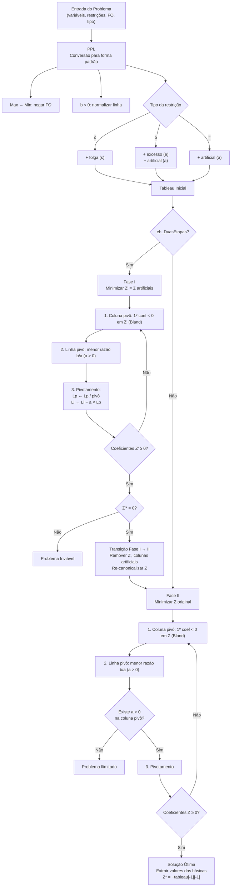

# SimplexCode

Implementação do **Método Simplex** (Uma Fase e Duas Fases) para resolução de Problemas de Programação Linear, com interface gráfica Tkinter, visualização passo a passo dos tableaus, gráfico da região viável e exportação de relatório em PDF.

## Fluxo do Algoritmo



## Instalação

```bash
# Requisitos: Python 3.11+

# Clonar o repositório
git clone <repo-url>
cd SimplexCode

# Instalar dependências
pip install matplotlib reportlab
```

## Como Usar

```bash
# Executar a aplicação
python main.py
```

1. Preencha os dados do problema na tela inicial (variáveis, restrições, função objetivo, tipo)
2. Clique em **Resolver** para executar o algoritmo
3. Navegue pelos quadros com `<<` `<` `>` `>>` para acompanhar cada iteração
4. O painel abaixo do tableau mostra o **teste da razão** e as **operações de linha**
5. Se o problema tiver 2 variáveis, o **gráfico da região viável** abre automaticamente
6. Use **Exportar PDF** para gerar um relatório completo com todas as etapas

### Executar Testes

```bash
python -m pytest test\ -v
```
